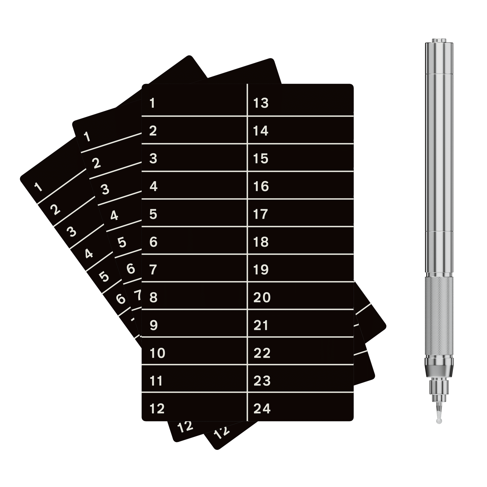

# Xellox Yokis – Steel Seed Phrase Backup Kit

**Xellox Yokis** is a professional-grade seed phrase backup kit designed to keep your Bitcoin recovery words safe from fire, water, and physical damage. Built for long-term cold storage and true Bitcoin self-custody.

## 🔐 What's in the Box

- 3× bulletproof-grade stainless steel seed plates  
- 1× precision electric engraver (USB rechargeable)  
- Durable carrying case and safety gear  

Perfect for securing 12- or 24-word seed phrases offline — without relying on third parties or internet access.

## 💡 Why Xellox Yokis?

- Fire-resistant  
- Shockproof and waterproof  
- Compatible with all hardware wallets and BIP39 setups  
- Ideal for long-term inheritance or sovereign cold storage setups  

## 🎯 For Bitcoin Hodlers

Yokis was built for Bitcoiners who understand that **not your keys means not your coins**. Protect your keys like your wealth depends on it — because it does.

## 🔗 Useful Links

- 🌐 [Product page](https://www.xellox.io/yokis/)
- 🛍️ [Buy Yokis kit](https:)

